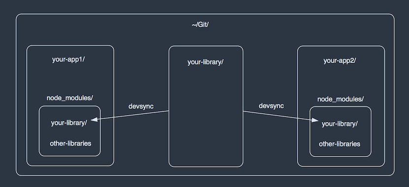

# Devsync

Sync your own npm library directly into the package which depends on it. If you're a publisher of libraries on npm, yes, `devsync` has been made for you!



## Use case

Devsync might be useful in such a situation:

- You have a main application `your-app`
- `your-app` has a dependency to `your-library`
- Adds features, or fixes bug on `your-library`
- Needs to update `your-library` in `your-app` locally, without `git push` or `npm publish`

## Installation

```bash
$ npm install -g cognitom/devsync
```

After some updates and reviews, we'll publish to npm, soon. Then,

```bash
$ npm install -g devsync
```

## Usage

Go to `your-library` directory and run `devsync`:

```bash
$ cd ~/Git/your-library
$ devsync
```

The example above assumes that you have a directory structure like this:

- `~/Git/your-app`: Your main application
- `~/Git/your-library`: Your library internally used in `your-app`

If you're working on the project at `Desktop`,  you could `devsync` like this:

```bash
$ cd ~/Git/your-library
$ devsync -t ~/Desktop/your-temporary-project
```

To watch and automatically `devsync`, `-w` flag would be useful:

```bash
$ cd ~/Git/your-library
$ devsync -w
```

## CLI options

### --target / -t

### --cwd / -c

### --watch / -w

## JavaScript API

```javascript
const
  devsync = require('devsync')

devsync({
  cwd: 'path/to/your-library',
  target: 'path/to/your-app'
})
```
